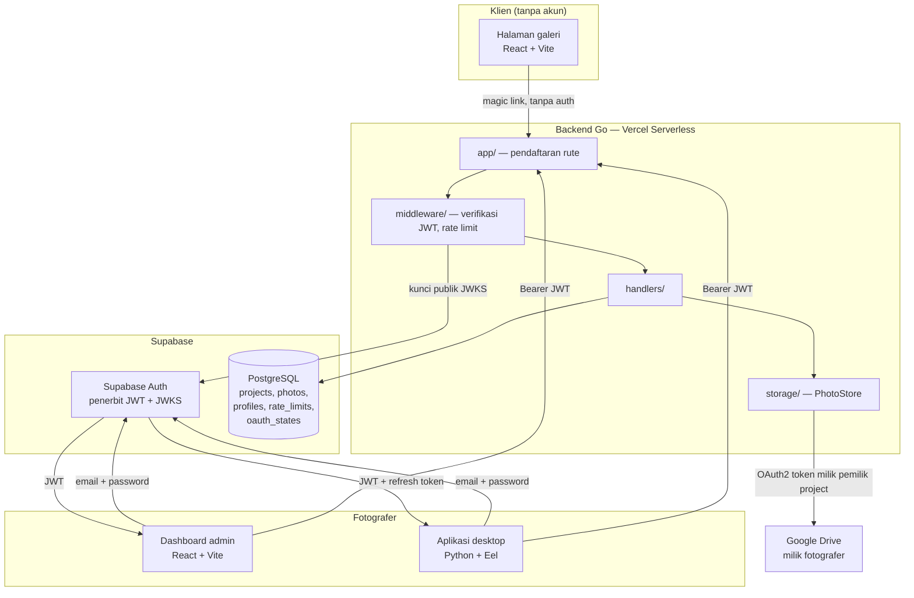
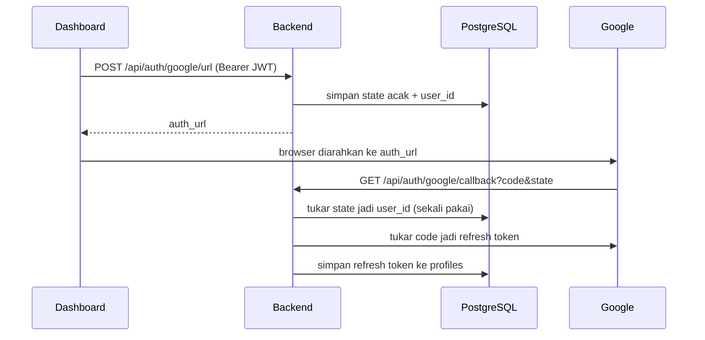

# PhotoFlow

[](https://github.com/indraaryaLabs/photoflow-ecosystem/actions/workflows/ci.yml)

Alat pemilihan foto untuk fotografer dan kliennya.

## Masalah yang dipecahkan

Setelah pemotretan, fotografer perlu klien memilih foto mana yang akan diedit.
Alur yang lazim dipakai buruk untuk keduanya: fotografer mengunggah ratusan foto
ke layanan lain, atau mengirim puluhan gambar lewat WhatsApp, lalu menerima
balasan berupa daftar nomor yang harus dicocokkan manual.

PhotoFlow menghapus langkah unggah ulangnya. Foto tetap berada di Google Drive
milik fotografer; aplikasi ini membacanya di tempat. Fotografer membuat project,
mendapat satu tautan, dan mengirimkannya ke klien. Klien membuka tautan itu
tanpa perlu akun, memilih, lalu mengirim. Setelah terkirim, galeri terkunci dan
fotografer memanen berkas aslinya lewat aplikasi desktop.

Ditujukan untuk fotografer lepas yang menangani sedikit klien sekaligus, bukan
untuk studio besar.

## Arsitektur



### Dua jalur masuk, dua model keamanan

**Fotografer** login lewat Supabase Auth dan membawa JWT pada setiap permintaan.
Backend memverifikasi tanda tangannya terhadap kunci publik JWKS Supabase, lalu
mengambil identitas dari klaim `sub`. Backend tidak pernah menerima identitas
yang dikirim pemanggil.

Ini berlaku untuk kedua antarmuka fotografer. Dashboard web dan aplikasi
desktop sama-sama login langsung ke Supabase Auth dan membawa JWT yang sama;
tidak ada jalur login khusus desktop. Bedanya hanya pada tempat menyimpan
refresh token — browser mengurusnya sendiri, sedangkan aplikasi desktop
menyimpannya di keyring milik sistem operasi.

**Klien** tidak punya akun. Aksesnya berupa magic link 16 byte yang menentukan
satu project. Karena tidak ada yang bisa diautentikasi, pertahanannya adalah
entropi tautan, ditambah pembatasan percobaan gagal per IP untuk mempersulit
penebakan.

### Alur koneksi Google Drive



Parameter `state` tidak membawa data apa pun. Ia hanya nilai acak yang dicocokkan
dengan baris di database, sehingga callback tidak perlu mempercayai apa pun yang
dibawa kembali browser.

## Stack

| Lapisan | Teknologi |
|---|---|
| Backend | Go 1.26, Gin, GORM |
| Database | PostgreSQL (Supabase), Row Level Security |
| Autentikasi | JWT Supabase, diverifikasi lewat JWKS asimetris (ES256/RS256) |
| Integrasi | Google Drive API, OAuth2 dengan scope `drive.readonly` |
| Frontend | React 19, Vite, Tailwind |
| Aplikasi desktop | Python 3.11, Eel, PyInstaller, rawpy |
| Deploy | Vercel (dua project: backend dan web portal), GitHub Actions untuk build desktop |

## Struktur

```
photoflow-backend/
  api/          entry point Vercel Serverless
  app/          SetupRouter — pendaftaran rute saja, tanpa logika
  cmd/migrate/  perintah migrasi skema
  db/           koneksi database
  handlers/     handler HTTP dan logikanya
  middleware/   verifikasi JWT, rate limit, CORS, batas ukuran body
  models/       struct database dan struct input
  storage/      PhotoStore: GDriveStore dan FakeStore

photoflow-web-portal/
  src/components/  AdminLogin, AdminDashboard, galeri klien
  src/lib/         klien Supabase

photoflow-desktop/
  main.py          fungsi yang dipanggil antarmuka, operasi berkas, thumbnail
  auth.py          sesi Supabase Auth, penyimpanan token, pembaruan otomatis
  gdrive.py        operasi Google Drive
  telemetry.py     pelaporan crash, dimuat saat dibutuhkan
  config.py        konstanta, dapat ditimpa lewat environment variable
  web/             antarmuka Eel: HTML, CSS, JS
  tests/           tes unit, tanpa jaringan
```

Aplikasi desktop dulunya tinggal di dua repo terpisah, `photoflow-app` dan
`photoflow-app-macOS`, yang isinya 99% sama — hanya `main.py`, ikon, dan berkas
workflow yang berbeda. Keduanya juga hanya punya workflow build macOS, jadi
tidak ada satu pun yang benar-benar menghasilkan aplikasi Windows. Keduanya
sekarang digabung ke sini, dan satu matrix GitHub Actions membangun kedua
sistem dari sumber yang sama.

## Menjalankan secara lokal

### Backend

```bash
cd photoflow-backend
cp .env.example .env      # isi nilainya; .env tidak pernah di-commit
go run .
```

Variabel yang dibutuhkan ada di [`.env.example`](photoflow-backend/.env.example)
beserta keterangan masing-masing. `DATABASE_URL` dan `SUPABASE_URL` wajib —
server menolak menyala tanpa keduanya.

### Frontend

```bash
cd photoflow-web-portal
cp .env.example .env
npm install
npm run dev
```

### Aplikasi desktop

```bash
cd photoflow-desktop
python -m venv venv && source venv/bin/activate   # Windows: venv\Scripts\activate
pip install -r requirements.txt
python main.py
```

Semua alamat yang dituju dapat ditimpa lewat environment variable; daftarnya
ada di [`photoflow-desktop/README.md`](photoflow-desktop/README.md).

### Migrasi

Migrasi **tidak** berjalan otomatis saat startup. Sebelumnya `AutoMigrate`
dipanggil di dalam `SetupRouter`, yang di lingkungan serverless berarti berjalan
pada setiap cold start — perubahan skema jadi efek samping dari lalu lintas
biasa. Sekarang harus dijalankan dengan sengaja:

```bash
cd photoflow-backend
DATABASE_URL="..." go run ./cmd/migrate
```

Perintah itu juga menyalakan Row Level Security pada tabel yang dikelolanya,
lalu memeriksa **seluruh** skema `public` dan berhenti dengan error kalau ada
satu tabel pun tanpa RLS. Penjagaan itu ada karena GORM membuat tabel tanpa RLS,
dan di project Supabase tabel semacam itu dapat dibaca-tulis lewat REST API
memakai anon key yang ada di bundle frontend.

### Tes

```bash
cd photoflow-backend
go test ./...    # tes yang butuh database melewatkan dirinya sendiri
```

Untuk menjalankan seluruhnya, sediakan PostgreSQL dan isi `TEST_DATABASE_URL`:

```bash
TEST_DATABASE_URL="host=127.0.0.1 port=5432 user=postgres dbname=postgres sslmode=disable" \
  go test ./...
```

Tes aplikasi desktop tidak menyentuh jaringan dan tidak membuka jendela, jadi
`eel`, `Pillow`, dan `rawpy` tidak perlu terpasang untuk menjalankannya:

```bash
cd photoflow-desktop
pip install -r requirements-dev.txt
python -m unittest discover -s tests -v
```

Variabelnya sengaja terpisah dari `DATABASE_URL`: tes tersebut menjalankan
`DROP TABLE`, jadi menunjuk variabel yang sama dengan produksi akan menghapus
data yang sedang dipakai.

## Demo

- Web portal: https://photoflow-ecosystem.vercel.app
- API: https://photoflow-backend.vercel.app

### Coba tanpa akun

Galeri klien memang tidak butuh login — itu inti produknya. Dua tautan di bawah
membuka galeri sungguhan, persis seperti yang diterima klien lewat WhatsApp.

**Galeri yang menunggu dipilih** — pilih foto, perhatikan penghitung dan batas
maksimalnya:

```
https://photoflow-ecosystem.vercel.app/?token=fb0bd309058553e34dbe46f19f04a405
```

**Galeri yang sudah dikirim** — terkunci, tidak menerima perubahan lagi:

```
https://photoflow-ecosystem.vercel.app/?token=51fafe800d88d1bf22ffbd6f6b13cac6
```

Nomor WhatsApp pada kedua galeri itu sengaja placeholder. Baris project
dikembalikan utuh oleh `GET /api/p/:magic_link`, jadi nomor apa pun yang
tersimpan di sana terbaca oleh siapa saja yang memegang tautannya.

### Dashboard fotografer

Sisi fotografer butuh login. Akun demo dibuat dari dashboard Supabase, bukan
lewat form pendaftaran: form itu memanggil `supabase.auth.signUp()` yang
mengirim email konfirmasi, dan alamat demo tidak punya inbox. Buat lewat
**Authentication → Users → Add user**, centang **Auto Confirm User**, lalu isi
datanya dengan [`scripts/seed-demo.sql`](scripts/seed-demo.sql).

> **Kredensial demo belum dicantumkan.** Repo ini punya aturan bahwa tidak ada
> nilai kredensial yang boleh masuk berkas mana pun. Kalau bagian ini diisi,
> isi dengan akun yang khusus dibuat untuk demo, berisi data contoh saja, dan
> pahami bahwa siapa pun yang membaca repo ini dapat memakainya — termasuk
> menghapus project di dalamnya.

## Catatan keamanan

Repo ini menyimpan dua berkas yang menjelaskan sisi keamanannya:

- [`SECURITY-NOTES.md`](SECURITY-NOTES.md) — kerentanan yang ditemukan dan
  diperbaiki, lengkap dengan cara mengeksploitasinya dan tes yang membuktikan
  perbaikannya.
- [`FINDINGS.md`](FINDINGS.md) — seluruh temuan beserta statusnya, termasuk yang
  sengaja dibiarkan terbuka dan alasannya.
